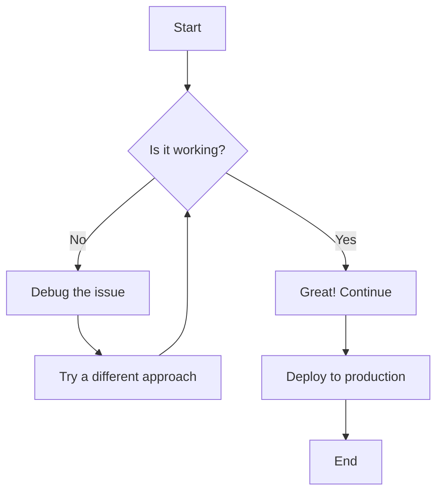
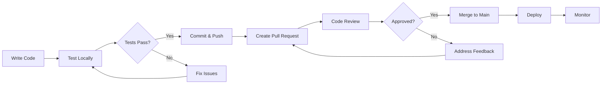
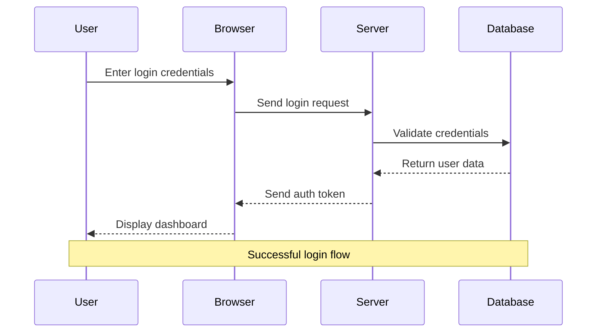
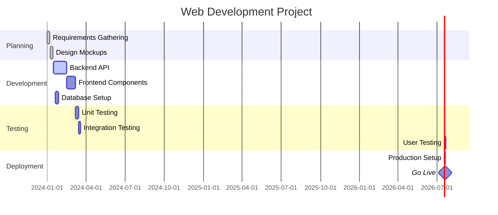
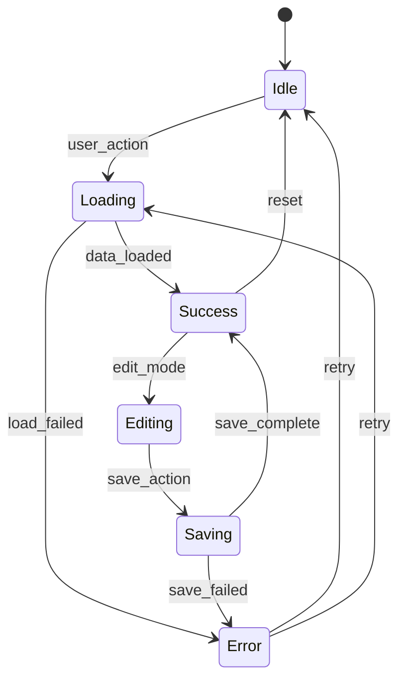
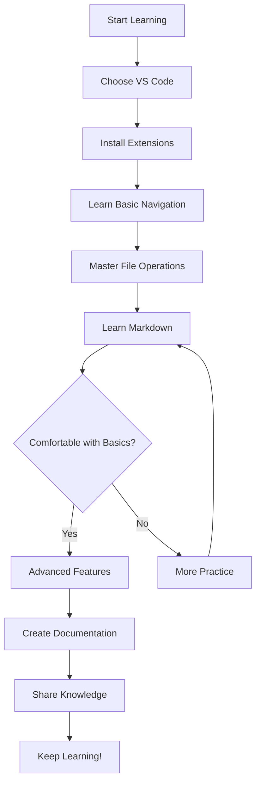
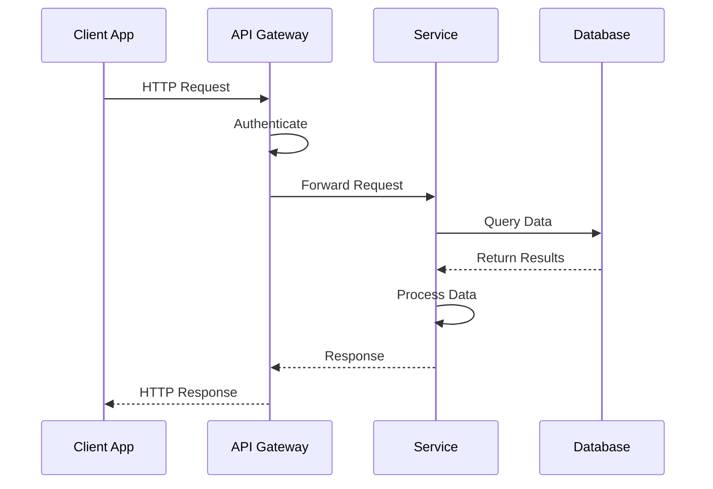
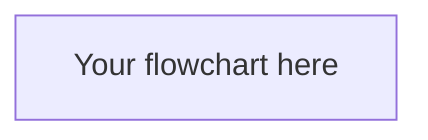

# Diagrams and Mermaid in Markdown

This document demonstrates how to create diagrams using Mermaid syntax within Markdown documents. Mermaid allows you to create flowcharts, sequence diagrams, Gantt charts, and more using simple text syntax.

## What is Mermaid?

Mermaid is a diagramming and charting tool that uses text-based syntax to create diagrams. It's particularly useful for:
- **Documentation**: Visual representation of processes and workflows
- **Planning**: Project timelines and system architectures  
- **Communication**: Clear visual explanations of complex concepts
- **Version Control**: Text-based diagrams can be tracked in Git

## Setting Up Mermaid in VS Code

To use Mermaid diagrams in VS Code, install these extensions:
1. **Markdown Preview Enhanced** - Renders Mermaid diagrams in preview
2. **Mermaid Markdown Syntax Highlighting** - Syntax highlighting for Mermaid code
3. **Mermaid Editor** (optional) - Dedicated Mermaid diagram editor

## Basic Flowchart

Here's a simple flowchart showing a decision process:



### Code Explanation:
- `flowchart TD` - Creates a top-down flowchart
- `A[Start]` - Rectangle node with text "Start"
- `B{Is it working?}` - Diamond node for decisions
- `-->` - Arrow connection
- `|Yes|` - Label on the arrow

## Software Development Workflow



## Sequence Diagram

Sequence diagrams show interactions between different actors over time:



### Sequence Diagram Elements:
- `participant` - Define the actors
- `->>` - Solid arrow (synchronous call)
- `-->>` - Dashed arrow (response)
- `Note over` - Add explanatory notes

## Git Workflow Diagram

```mermaid
gitgraph
    commit id: "Initial commit"
    branch feature
    checkout feature
    commit id: "Add new feature"
    commit id: "Fix bug in feature"
    checkout main
    commit id: "Hotfix"
    merge feature
    commit id: "Release v1.1"
```

## Class Diagram

Shows relationships between classes in object-oriented design:

```mermaid
classDiagram
    class User {
        +String name
        +String email
        +login()
        +logout()
    }
    
    class Document {
        +String title
        +String content
        +Date created
        +save()
        +delete()
    }
    
    class Project {
        +String name
        +Date deadline
        +addDocument()
        +removeDocument()
    }
    
    User ||--o{ Document : creates
    Project ||--o{ Document : contains
    User ||--o{ Project : owns
```

## Gantt Chart

Project timeline visualization:



## State Diagram

Shows different states and transitions:



## Practical Examples

### Learning Path Flowchart



### API Request Flow



## Tips for Creating Effective Diagrams

### Do's:
✅ **Keep it simple** - Don't overcomplicate diagrams  
✅ **Use consistent naming** - Clear, descriptive labels  
✅ **Add explanatory text** - Context helps understanding  
✅ **Choose the right diagram type** - Match diagram to purpose  

### Don'ts:
❌ **Too many elements** - Cluttered diagrams are hard to read  
❌ **Inconsistent flow** - Follow logical progression  
❌ **Missing context** - Always explain what the diagram shows  
❌ **Wrong diagram type** - Use appropriate diagram for the concept  

## Common Mermaid Diagram Types

| Diagram Type | Use Case | Syntax Starts With |
|-------------|----------|-------------------|
| **Flowchart** | Process flows, decision trees | `flowchart` |
| **Sequence** | Interactions over time | `sequenceDiagram` |
| **Class** | Object relationships | `classDiagram` |
| **State** | State transitions | `stateDiagram-v2` |
| **Gantt** | Project timelines | `gantt` |
| **Git Graph** | Version control flow | `gitgraph` |
| **Pie Chart** | Data proportions | `pie` |

## Practice Exercises

### Exercise 1: Create Your Own Flowchart
Design a flowchart for your morning routine or a process you know well.



### Exercise 2: Document a System
Create a sequence diagram showing how you interact with a website (login, browse, purchase, etc.).

### Exercise 3: Plan a Project
Create a simple Gantt chart for a personal project or goal.

---

## Resources and References

### Learning Mermaid
- [Mermaid Official Documentation](https://mermaid.js.org/)
- [Mermaid Live Editor](https://mermaid.live/) - Test diagrams online
- [GitHub Mermaid Support](https://github.blog/2022-02-14-include-diagrams-markdown-files-mermaid/)

### VS Code Extensions
- [Markdown Preview Enhanced](https://marketplace.visualstudio.com/items?itemName=shd101wyy.markdown-preview-enhanced)
- [Mermaid Markdown Syntax Highlighting](https://marketplace.visualstudio.com/items?itemName=bpruitt-goddard.mermaid-markdown-syntax-highlighting)

---

*Remember: Diagrams should clarify, not complicate. Start simple and add complexity only when needed!*